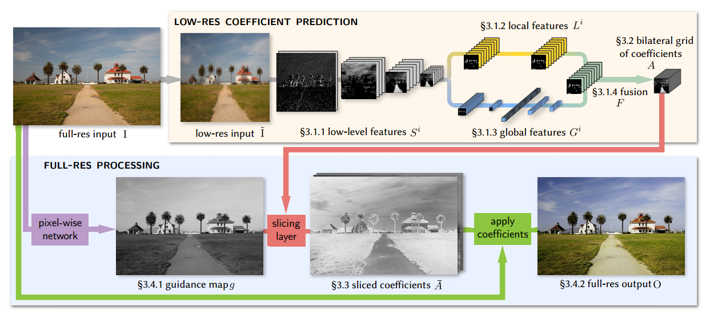
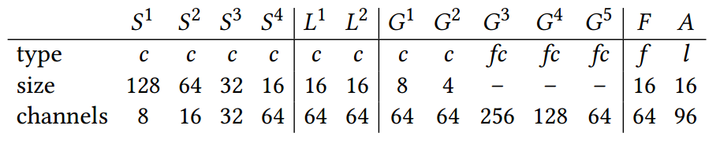

## hdrnet-mobile

#### 1. 简介

本项目为文献*Deep Bilateral Learning for Real-Time Image Enhancement*的C++算法实现。

#### 2. 算法结构

全网络分为低分辨率参数预测(Low-Res Coefficient Prediction)和高分辨率处理(High-Res Precessing)两部分。全分辨率的RGB图像full-res input，经下采样处理成256x256的RGB图像low-res input。

##### 2.1 Low-Res Coefficient Prediction

该部分网络结构是由经典CNN Layer构成。

1. 首先采用4层级联的conv层（kernel_size=3x3, stride=2x2），每个conv层后紧跟ReLU激活层。用于提取low-level特征，并降低空间分辨率。feature map尺寸从256x256降低为32x32，feature map的channel数成倍增加。
2. 采用两层conv层（kernel_size=3x3, stride=1x1）。，用于提取局部特征。
3. 采用两层conv层和fc层，采用提取全局特征。
4. 将局部特征和全局特征融合，进行一次conv层，作为3D bilateral grid。

##### 2.2 生成引导图(guided map)

采用pixel-wise network将full-res input产生full-res灰度图。

##### 2.3 sliced coefficients

##### 2.4 使用slice coeffcients生成处理后的full-res输出

